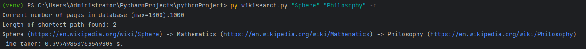

# Wikisearch

Just trying to learn how to scrape information
from websites and to use SQLite. This project is inspired by [Six Degrees of Wikipedia](https://github.com/jwngr/sdow).

## How it works
Information is scrapped and parsed using [BeautifulSoup](https://pypi.org/project/beautifulsoup4/#:~:text=Beautiful%20Soup%20is%20a%20library,and%20modifying%20the%20parse%20tree.). The information about each page is stored as a table in an SQLite database. On user request, a database search will be done and will return a valid path if found. Otherwise, direct scraping will begin and store all the information into the database (up to 1000 pages) and will return the path if found. 

## Instructions

1. Install Python 3
2. Create a new virtual environment
3. Run ``pip install -r requirements.txt`` in terminal/shell
4. CD into the directory containing ``ws.py``.
5. To run the app, run ``py ws.py <Base Page> <Destination Page> [extra_cmd]`` in the terminal/shell, where 'Base Page' is the title of the base wikipedia page and 'Destination Page' is the title of the destination wikipedia page and 'extra_cmd' is an extra specification
   - ``-d``: specifies the 'dynamic' searching mode
   - ``-db``: specifies the 'database only' searching mode

## Notes
- It currently can take a long time (10 minutes or more) to run the program depending on inputs and if the path does not exist in the database.
- ~~Currently, the maximum length of a path is 3 (including base & destination pages).~~ Paths can be longer now.
- If a Wikipedia page is not found, the program will end immediately.
- Activating the '-d' command will on average speed up completion by alot, however it may return a path that is longer than optimal.
- Activating the '-db' command will stop live scraping, and only look for valid paths in the database.
- The '-d' and '-db' commands are mutually exclusive and cannot be applied at the same time.